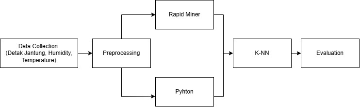
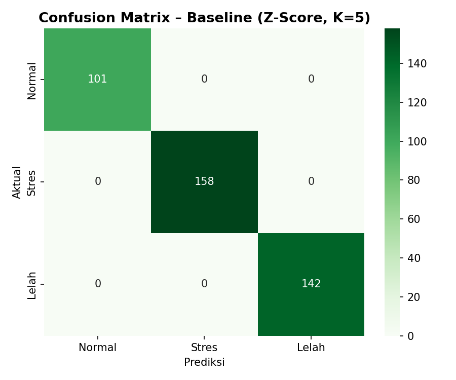
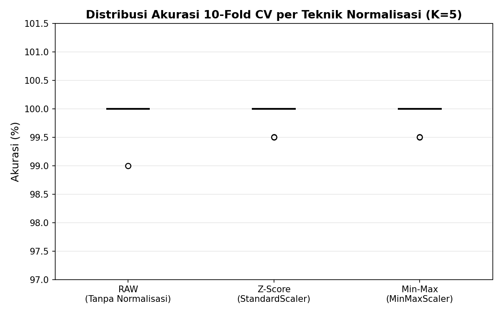
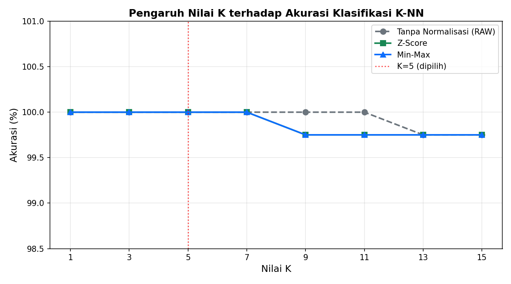

# 🧠 K-NN Classification for Stress and Fatigue Detection based on Physiological Signals


## 📌 Project Overview
This repository contains the source code and experimental data for the research paper: **"Implementasi Algoritma K-Nearest Neighbor (K-NN) untuk Deteksi Tingkat Stres dan Kelelahan Berbasis Sinyal Fisiologis Tubuh"** (published in TEKTRIKA Journal). 

The project aims to develop a robust classification model using the **K-Nearest Neighbor (K-NN)** algorithm to classify three physiological states: **Normal, Stress, and Fatigue**. By integrating **Body Temperature** alongside **Heart Rate** and **Galvanic Skin Response (GSR)**, this study successfully isolates fatigue (hypometabolism) from stress (hypermetabolism) with high precision.

<p align="center">
  
</p>

## 🚀 Key Features & Novelty
* **Multi-Sensor Fusion:** Integration of Heart Rate, GSR, and Body Temperature for 3-class classification.
* **Normalization Comparative Analysis:** A rigorous head-to-head comparison between `Z-Score (StandardScaler)` and `Min-Max (MinMaxScaler)`.
* **10-Fold Stratified Cross-Validation:** Ensures the model's stability and robustness against data variance and outliers.
* **Hyperparameter Optimization:** Empirical testing for optimal K values (K=1 to K=15) based on the bias-variance trade-off.

## 📂 Repository Structure
* `/dataset`: Contains the `Stress-Lysis.csv` dataset used for the experiments.
* `/notebooks`: Contains the Jupyter Notebook (`.ipynb`) with the full pipeline (Preprocessing, K-NN Modeling, and Evaluation).
* `/images`: Contains high-resolution grayscale visualizations generated during the experiments (`diagram_sistem.jpg`, `cm_baseline.png`, `kurva_k_optimasi.png`, `boxplot_cv.png`, `bar_normalisasi.png`).

## 📊 Key Results

* **Hold-out Accuracy (80:20):** 100% across all preprocessing techniques due to the high deterministic separability of the dataset.

<p align="center">
  
</p>

* **Model Stability (10-Fold CV):** Z-Score and Min-Max normalizations significantly improved model stability, reducing the standard deviation from **0.40% (RAW)** down to **0.20%**. 

<p align="center">
  
</p>

* **Optimal K:** K=5 was selected as the optimal hyperparameter.

<p align="center">
  
</p>

* **Recommendation:** **Z-Score Normalization** is recommended for physiological sensor data due to its robustness against outliers.

## 🛠️ How to Run

1. Clone this repository:
   ```bash
   git clone https://github.com/rafaz-electrics/knn-physiological-stress-fatigue-detection.git
2. Install the required dependencies:
   ```bash
   pip install -r requirements.txt
3. Open the Jupyter Notebook in /notebooks to run the simulations.

👨‍💻 Author
Radithya Farrella Azmi
Institution: Universitas Negeri Malang
